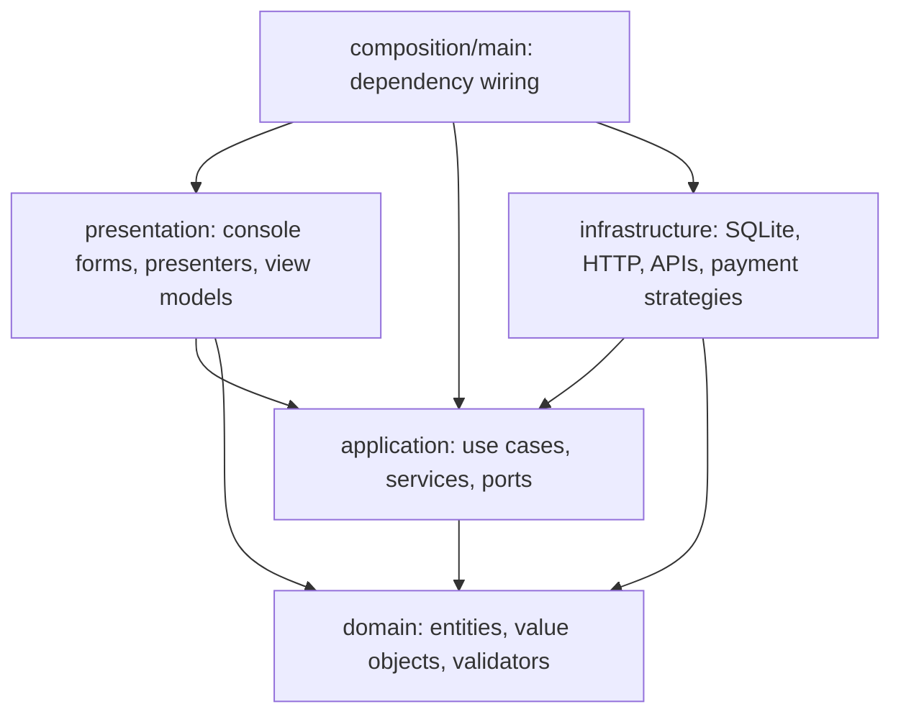
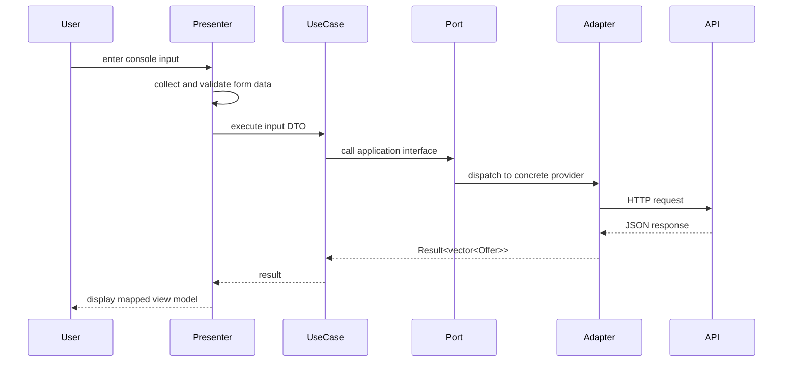
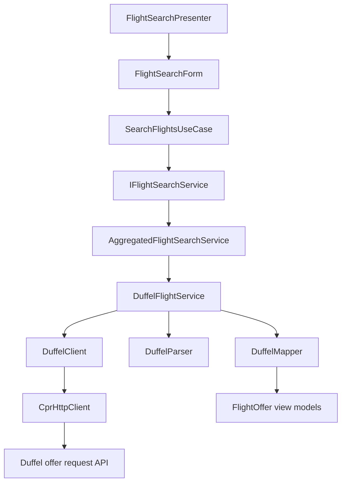
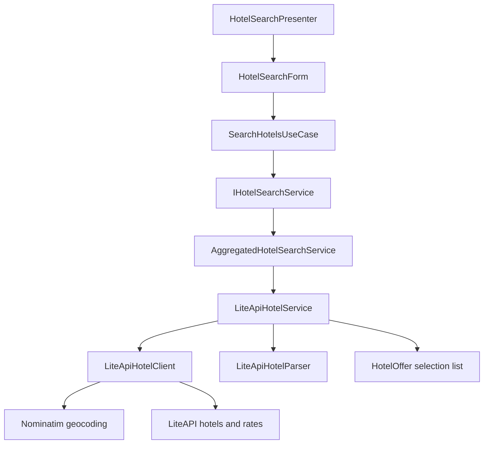
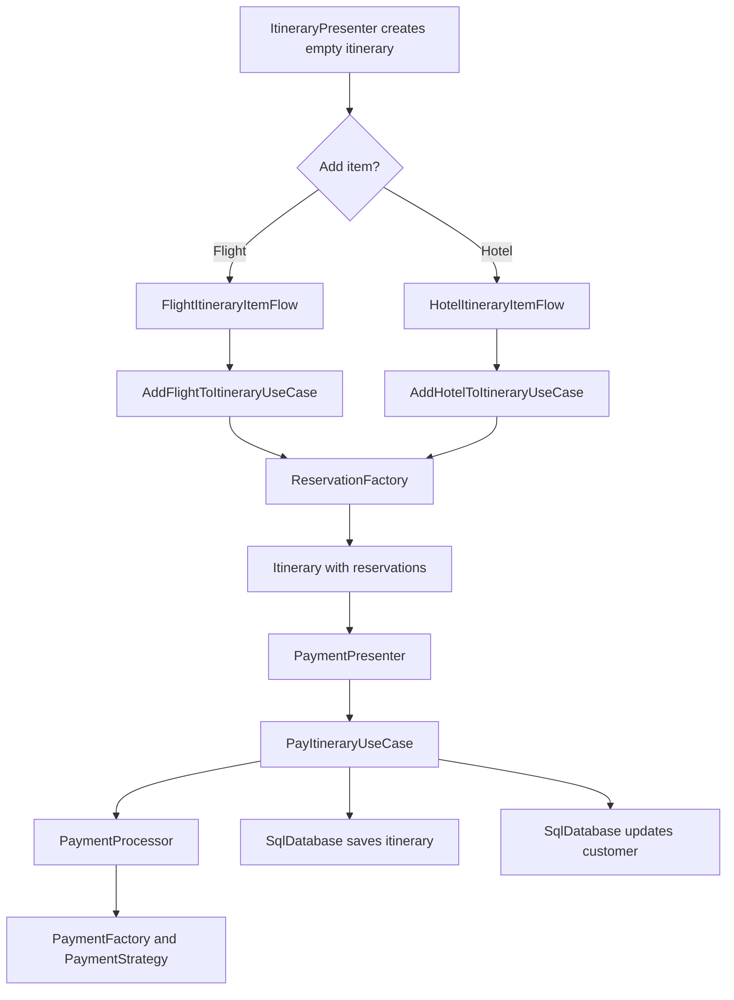
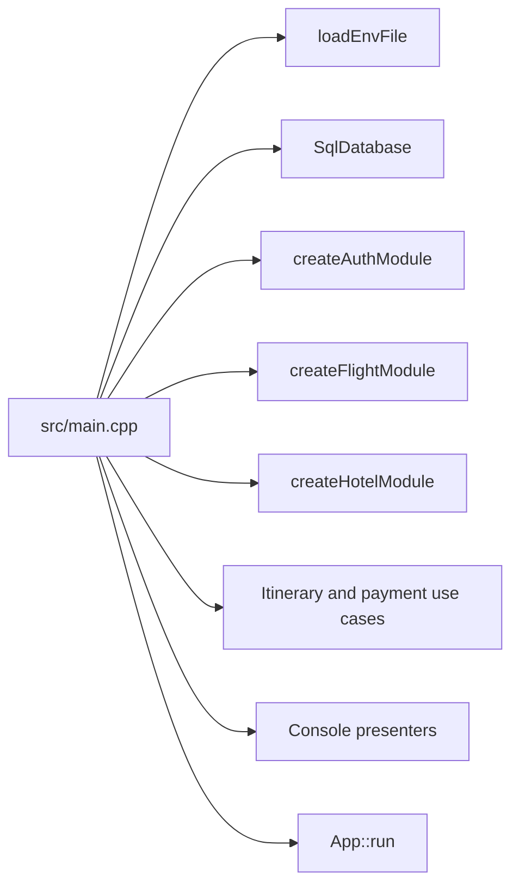

# Travel Booking System

## Overview

Travel Booking System is a C++17 console application for searching travel offers, creating itineraries, collecting payment details, and persisting confirmed itineraries locally in SQLite.

The project is structured as a layered, dependency-inverted application rather than a single procedural CLI. Domain models live separately from use cases, provider integrations, persistence, and console presentation. The composition root in `src/main.cpp` wires concrete infrastructure into application services and presenters.

Demo walkthrough: https://youtu.be/4njfqKla5yE

## Features

- User sign-up, login, logout, and profile display.
- Flight search through a Duffel-backed provider adapter.
- Hotel search through a LiteAPI-backed provider adapter with OpenStreetMap Nominatim geocoding.
- Itinerary creation with flight and hotel reservation items.
- Checkout flow with selectable payment strategies: PayPal, Stripe, and Square.
- SQLite persistence for users, customer cards, itineraries, and serialized reservations.
- JSON serialization and deserialization for polymorphic flight and hotel reservations.
- GoogleTest coverage for factories, serialization, payment behavior, use cases, and SQLite integration.
- GitHub Actions CI for configure, build, test, clang-tidy, clang-format, and Linux artifact upload.

## Architecture

The source tree follows a layered architecture with Clean Architecture / Ports and Adapters characteristics:

- `src/domain/` contains business entities, value objects, validators, visitors, and factories. It does not depend on the console UI, SQLite, CPR, or external travel APIs.
- `src/application/` contains use cases, services, repository interfaces, provider interfaces, DTOs, and result types. This layer depends on the domain layer and defines ports such as `IFlightSearchService`, `IHotelSearchService`, `IUserRepository`, `ICustomerRepository`, and `IItineraryRepository`.
- `src/infrastructure/` implements adapters for persistence, HTTP, external travel APIs, payment strategies, serialization, and factories.
- `src/presentation/` implements the console frontend, forms, presenters, mappers, and itinerary item flows.
- `src/composition/` assembles feature modules. `src/main.cpp` is the final composition root.

### Dependency Direction



### Notable Patterns in the Code

- Dependency inversion: use cases depend on interfaces such as `IFlightSearchService`, `IHotelSearchService`, and repository interfaces in `src/application/`.
- Composition root: `src/main.cpp` creates `SqlDatabase`, presenters, use cases, modules, payment factory callbacks, and the `App`.
- Ports and adapters: `src/infrastructure/flight/duffel/` and `src/infrastructure/hotel/liteapi/` adapt external APIs behind application-facing search interfaces.
- Strategy pattern: `PaymentStrategy` in `src/application/payments/payment_strategy.hpp` is implemented by PayPal, Stripe, and Square strategies under `src/infrastructure/payments/`.
- Factory pattern: `ReservationFactory` creates typed reservation objects from `RequestType`; `PaymentFactory` selects concrete payment strategies.
- Visitor pattern: reservation serialization uses `ReservationVisitor` so polymorphic reservation types can be written to JSON.
- RAII: `SqlDatabase::Statement` finalizes `sqlite3_stmt*` handles automatically, and `SqlDatabase` closes the SQLite connection in its destructor.

## Technical Highlights

- Clean separation of business rules and infrastructure: domain entities such as `Itinerary`, `Reservation`, `FlightReservation`, and `HotelReservation` are independent of SQLite and HTTP.
- Testable application services: `PaymentProcessor` accepts payment-strategy and reservation-confirmation callbacks, allowing tests to inject success and failure behavior without external services.
- Repository abstraction over persistence: `SqlDatabase` implements `IUserRepository`, `ICustomerRepository`, and `IItineraryRepository`, keeping use cases independent from SQL details.
- Provider aggregation: `AggregatedFlightSearchService` and `AggregatedHotelSearchService` combine results from one or more providers and preserve provider errors when all providers fail.
- Polymorphic persistence model: reservations are stored in SQLite as JSON and reconstructed as concrete flight or hotel reservation objects.
- Modern C++ ownership model: itinerary reservations and provider services are owned with `std::unique_ptr`; optional lookups use `std::optional`; success/failure flows use a generic `Result<T>`.
- Local developer feedback loop: CMake exports `compile_commands.json`, builds tests by default, and CI validates compilation, tests, formatting, and static analysis.

## Project Structure

```text
.
|-- .github/
|   `-- workflows/
|       `-- ci.yml
|-- src/
|   |-- application/
|   |   |-- dto/
|   |   |-- interfaces/
|   |   |-- mappers/
|   |   |-- payments/
|   |   |-- providers/
|   |   |-- repositories/
|   |   |-- results/
|   |   |-- services/
|   |   `-- use_cases/
|   |-- composition/
|   |   |-- auth/
|   |   |-- flight/
|   |   `-- hotel/
|   |-- domain/
|   |   |-- entities/
|   |   |-- factories/
|   |   |-- validators/
|   |   |-- value_objects/
|   |   `-- visitors/
|   |-- infrastructure/
|   |   |-- apis/
|   |   |-- config/
|   |   |-- factories/
|   |   |-- flight/
|   |   |-- hotel/
|   |   |-- http/
|   |   |-- payments/
|   |   |-- persistence/
|   |   `-- serialization/
|   |-- presentation/
|   |   |-- forms/
|   |   |-- formatters/
|   |   |-- itinerary_item_flows/
|   |   |-- mappers/
|   |   |-- presenters/
|   |   `-- view/
|   |-- tests/
|   |-- third_party/
|   |-- util/
|   |-- app.cpp
|   `-- main.cpp
|-- .clang-format
|-- .env.example
|-- CMakeLists.txt
`-- README.md
```

## System Workflows

### Request Processing Flow



### Flight Search Flow



### Hotel Search Flow



### Itinerary Checkout Flow



### Composition Flow



## Build Instructions

### Prerequisites

- CMake 3.20 or newer.
- A C++17 compiler.
- Ninja, Make, Visual Studio, or another CMake generator.
- Network access during the first configure step so CMake can fetch external dependencies.

The project uses CMake `FetchContent` for:

- GoogleTest v1.14.0 when `BUILD_TESTS=ON`.
- CPR 1.10.5 for HTTP.
- SQLite amalgamation `sqlite-amalgamation-3490100.zip`.

The repository also vendors the single-header nlohmann/json implementation at `src/third_party/json.hpp`.

### Configure and Build

The CI workflow configures from `src/`, which places the executable directly in the build directory:

```bash
cmake -S src -B build-ninja -G Ninja
cmake --build build-ninja
```

You can also configure from the repository root:

```bash
cmake -S . -B build
cmake --build build
```

Useful CMake options:

```bash
cmake -S src -B build-ninja -G Ninja -DBUILD_TESTS=ON -DENABLE_WARNINGS=ON
cmake -S src -B build-release -G Ninja -DCMAKE_BUILD_TYPE=Release
```

## Configuration

Copy `.env.example` to `.env` and provide API keys for live provider-backed search:

```text
DUFFEL_API_KEY=your_duffel_api_key
LITEAPI_KEY=your_liteapi_key
```

At startup, `src/main.cpp` calls `loadEnvFile(".env")`. The flight and hotel modules then read those variables through `ApiConfig::getEnvVar`.

SQLite uses `travel.db` by default in the current working directory. Tests create temporary databases under the system temp directory.

## Running the Application

After configuring with `cmake -S src -B build-ninja -G Ninja`:

```bash
./build-ninja/travel_app
```

On Windows:

```powershell
.\build-ninja\travel_app.exe
```

If you configure from the repository root, the executable may be under `build/src/` depending on the generator:

```bash
./build/src/travel_app
```

## Development Workflow

Format source files with the repository style:

```bash
clang-format -i src/**/*.cpp src/**/*.hpp
```

The checked-in `.clang-format` is based on LLVM, uses 4-space indentation, Allman braces, a 120-column limit, and left pointer alignment.

For static analysis, generate `compile_commands.json` with CMake and run clang-tidy against source files:

```bash
cmake -S src -B build-ninja -G Ninja
clang-tidy -p build-ninja src/app.cpp
```

## Testing

Build tests with the default `BUILD_TESTS=ON` option and run:

```bash
ctest --test-dir build-ninja --output-on-failure
```

Current automated coverage includes:

- `ReservationFactory` creation behavior.
- Reservation JSON serialization and deserialization round trips.
- Payment processor success and failure paths with injected test strategies.
- `PayItineraryUseCase` persistence behavior on successful payment and failure.
- Reservation service booking-provider dispatch.
- SQLite integration for users, duplicate email handling, customer cards, itinerary persistence, and persistence across sessions.

Verified locally against the existing `build-ninja` directory: 24/24 tests passed.

## CI/CD

GitHub Actions is configured in `.github/workflows/ci.yml`.

The `CI` workflow runs on pushes to `master` and on pull requests. It performs:

- Repository checkout.
- Installation of `clang-format-15`, `clang-tidy`, and Ninja on Ubuntu.
- CMake configure with `cmake -S src -B build-ninja -G Ninja`.
- Full build with `cmake --build build-ninja`.
- clang-tidy over `src/**/*.cpp`, excluding `src/third_party`; this step currently uses `continue-on-error: true`.
- Test execution with `ctest --test-dir build-ninja --output-on-failure`.
- Upload of the Linux `travel_app` executable as a workflow artifact.
- Formatting verification with `clang-format-15 --dry-run --Werror`.

## External Integrations

- Duffel: flight offer requests through `https://api.duffel.com/air/offer_requests`.
- LiteAPI: hotel data and rate search through `https://api.liteapi.travel/v3.0/...`.
- OpenStreetMap Nominatim: city-to-coordinate lookup before LiteAPI hotel search.
- CPR/libcurl: synchronous HTTP transport adapter.
- SQLite: local persistence.

The repository also contains additional mock and placeholder provider code under `src/infrastructure/apis/`, including mock flight search and booking adapters used for offline-style testing and extensibility.

## Future Improvements

- Wire `ReservationService` into the production composition root instead of the current simple confirmation callback in `src/main.cpp`.
- Add explicit database transactions around checkout so payment, itinerary save, and customer update are handled atomically.
- Replace placeholder payment strategies with real provider clients or clearly separate demo strategies from production adapters.
- Add end-to-end console workflow tests around authentication, itinerary creation, and checkout.
- Add richer validation for dates, airports, card details, and provider responses.
- Move generated databases and build artifacts out of the repository tree consistently.

## License

No license file is currently present in the repository. Add a `LICENSE` file before distributing or accepting external contributions.
